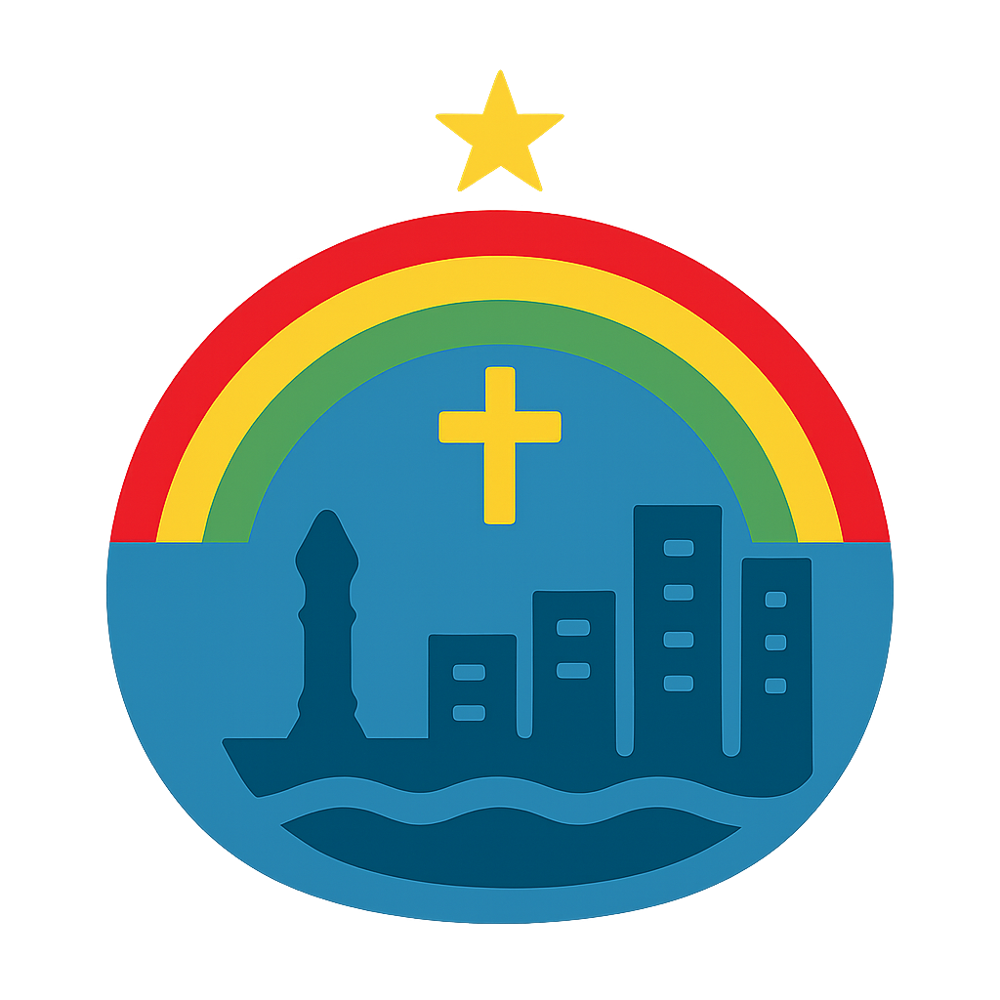

<h1 align="center">
  
   
  Conexão Brennand
   
</h1>

<h4 align="center"> Solução digital para gestão turística e cultural do Parque das Esculturas Francisco Brennand</h4>

___

### Nosso Propósito
O Conexão Brennand é uma plataforma digital integrada desenvolvida para modernizar a gestão do Parque das Esculturas
Francisco Brennand, um dos maiores ícones turísticos e culturais do Recife.

Com a recente transição para um sistema de acesso controlado - essencial para a preservação das obras - surgiu a 
necessidade de implementar ferramentas modernas de gestão turística para substituir o controle manual de visitantes.

___

### Objetivos
- Coletar feedbacks estruturados dos visitantes em tempo real.
- Monitorar digitalmente o fluxo de visitantes (entradas/saídas, picos de movimento, sazonalidade).
- Capturar dados sobre perfil dos visitantes (idade, origem, padrões de comportamento).
- Fornecer insights estratégicos.

___

    
Entrega 01

___

### Stack
- 
- 
- 
- 

___

### Nossa Equipe
- Ana Beatriz Astle
- Denise Hollanda
- João Victor Astle
- Maria Luiza Melo
- Mateus Guimarães
- Vinicius Cardoso

